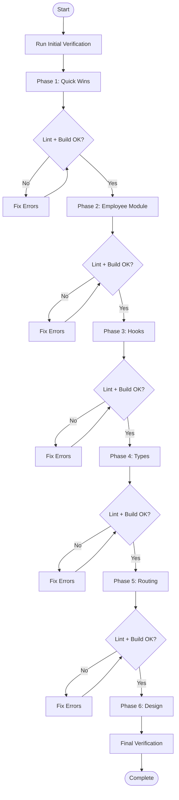

# 🎯 EKKA APP CONSOLIDATION - MASTER ORCHESTRATOR

> **Project**: Unified Ekka App Refactoring  
> **Version**: 1.0.0  
> **Created**: January 26, 2025  
> **Status**: Ready for Execution

---

## 🚨 CRITICAL: AI EXECUTION RULES

> [!CAUTION]
> **MANDATORY BEFORE ANY CODE CHANGE**
> 1. Run `npm run lint` — Fix ALL errors before proceeding
> 2. Run `npm run build` — Must complete successfully
> 3. Run `npx tsc --noEmit` — Zero type errors required
> 4. **NEVER ASSUME** — Verify file existence before editing
> 5. **NEVER HALLUCINATE** — Use `grep_search` to find actual implementations

### Anti-Hallucination Checklist
```
□ I have verified the file exists using find_by_name or list_dir
□ I have read the current file content using view_file
□ I understand the existing code structure
□ I have checked for existing imports before adding duplicates
□ I will run lint/build after every change
```

---

## 📁 Plan Document Structure

```
wrapup_plan/
├── 00_ORCHESTRATOR.md         # THIS FILE - Master control
├── 01_CHECKLIST.md            # Execution checklist
├── 02_PHASE1_QUICK_WINS.md    # High-impact quick fixes
├── 03_PHASE2_EMPLOYEE_MODULE.md # Employee consolidation
├── 04_PHASE3_HOOKS.md         # Hook centralization
├── 05_PHASE4_TYPES.md         # Type unification
├── 06_PHASE5_ROUTING.md       # Route simplification
├── 07_PHASE6_DESIGN.md        # Design system unification
├── 08_TARGET_STRUCTURE.md     # Final folder structure
├── 09_SINGLE_SOURCE_TRUTH.md  # Source of truth mappings
└── 10_VERIFICATION.md         # Final verification steps
```

---

## 🔄 Execution Order



---

## 📊 Phase Summary Table

| Phase | Name | Est. Time | Files Changed | Risk Level | Dependencies |
|-------|------|-----------|---------------|------------|--------------|
| 1 | Quick Wins | 1-2 days | ~10 | Low | None |
| 2 | Employee Module | 3-5 days | ~50 | High | Phase 1 |
| 3 | Hook Consolidation | 2-3 days | ~40 | Medium | Phase 2 |
| 4 | Type Unification | 1-2 days | ~20 | Medium | Phase 3 |
| 5 | Routing Simplification | 1 day | ~5 | Low | Phase 4 |
| 6 | Design Unification | 2-3 days | ~30 | Medium | Phase 5 |

**Total Estimated Time**: 10-16 days

---

## 🛡️ Validation Commands

Run after EVERY significant change:

```powershell
# In project root: c:\Users\alazi\Downloads\EXPAND-EKKA\ekka-app

# 1. TypeScript check
npx tsc --noEmit

# 2. ESLint check
npm run lint

# 3. Build check
npm run build

# 4. Dev server test
npm run dev
```

---

## 📌 Key Principles

### React.js Best Practices
- ✅ Single Responsibility: One component = one purpose
- ✅ Composition over Inheritance
- ✅ Lift state up only when necessary
- ✅ Use custom hooks for reusable logic
- ✅ Memoize expensive computations

### TypeScript Best Practices
- ✅ Strict mode enabled
- ✅ No `any` types
- ✅ Prefer interfaces for objects, types for unions
- ✅ Export types from index.ts barrels
- ✅ Use discriminated unions for state

### Single Source of Truth
- 📍 Types → `packages/shared/src/types/`
- 📍 Hooks → `packages/shared/src/hooks/`
- 📍 Utilities → `packages/shared/src/utils/`
- 📍 UI Components → `packages/ui/src/components/`
- 📍 Constants → `packages/shared/src/constants/`

---

## ⚠️ WARNING: Common AI Mistakes

| Mistake | Prevention |
|---------|------------|
| Creating duplicate files | Always `find_by_name` first |
| Wrong import paths | Use `@shared/*` aliases, verify with grep |
| Breaking existing imports | Search for usages before moving files |
| Incomplete refactors | Follow checklist completely |
| Skipping validation | Run lint/build after EVERY change |

---

## 📚 Document Navigation

| Document | Purpose | When to Use |
|----------|---------|-------------|
| [01_CHECKLIST.md](./01_CHECKLIST.md) | Master execution checklist | Track overall progress |
| [02_PHASE1_QUICK_WINS.md](./02_PHASE1_QUICK_WINS.md) | Quick win tasks | Start here |
| [03_PHASE2_EMPLOYEE_MODULE.md](./03_PHASE2_EMPLOYEE_MODULE.md) | Employee consolidation | After Phase 1 |
| [04_PHASE3_HOOKS.md](./04_PHASE3_HOOKS.md) | Hook centralization | After Phase 2 |
| [05_PHASE4_TYPES.md](./05_PHASE4_TYPES.md) | Type unification | After Phase 3 |
| [06_PHASE5_ROUTING.md](./06_PHASE5_ROUTING.md) | Route simplification | After Phase 4 |
| [07_PHASE6_DESIGN.md](./07_PHASE6_DESIGN.md) | Design system | After Phase 5 |
| [08_TARGET_STRUCTURE.md](./08_TARGET_STRUCTURE.md) | Final structure | Reference |
| [09_SINGLE_SOURCE_TRUTH.md](./09_SINGLE_SOURCE_TRUTH.md) | Truth mappings | Reference |
| [10_VERIFICATION.md](./10_VERIFICATION.md) | Final checks | End of project |

---

*Last Updated: January 26, 2025*
