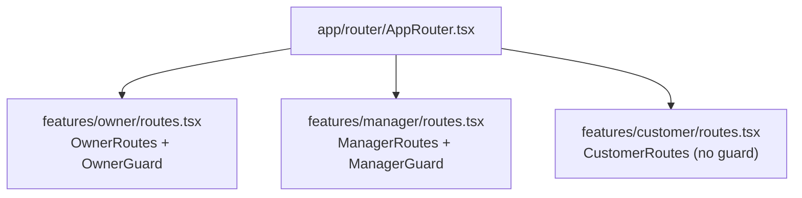

# 🛤️ PHASE 5: ROUTING SIMPLIFICATION

> **Estimated Time**: 1 day  
> **Risk Level**: Low  
> **Dependencies**: Phase 4 complete

---

## Overview

Simplify routing structure and standardize guard components.

---

## Current Issues

### Issue 1: Owner Routes Split

```
app/router/AppRouter.tsx      → imports OwnerRoutes
features/owner/routes.tsx     → defines OwnerRoutes, imports OwnerAppRoutes
app/router/ownerRoutes.tsx    → defines OwnerAppRoutes
```

**Problem**: Owner routing logic split across 3 files.

### Issue 2: Inconsistent Guard Naming

| Feature | Guard Name | Pattern |
|---------|------------|---------|
| Owner | `OwnerGuard` | `{Role}Guard` ✅ |
| Manager | `ProtectedRoute` | Generic name ❌ |

---

## Target Structure



**Delete**: `app/router/ownerRoutes.tsx` (merge into `features/owner/routes.tsx`)

---

## Step-by-Step Process

### Step 5.1: Merge Owner Route Files

**Source**: `app/router/ownerRoutes.tsx`  
**Target**: `features/owner/routes.tsx`

**Before** (2 files):

```typescript
// app/router/ownerRoutes.tsx
export const OwnerAppRoutes: React.FC<OwnerAppRoutesProps> = ({ selectedBranch }) => {
  return (
    <Routes>
      <Route index element={<Dashboard />} />
      <Route path="employees" element={<Employees />} />
      <Route path="settings" element={<Settings />} />
      <Route path="admin" element={<Admin />} />
    </Routes>
  );
};

// features/owner/routes.tsx
export const OwnerRoutes = () => (
  <Routes>
    <Route path="*" element={<OwnerShell />} />
  </Routes>
);
```

**After** (1 file):

```typescript
// features/owner/routes.tsx
import { lazy, Suspense, ReactNode, useEffect, useState } from 'react';
import { Navigate, Route, Routes, useLocation, Link } from 'react-router-dom';

import { ensureOwnerSession } from '@shared/lib/access-code/auth';
import Layout from '@shared/ui/components/shared/Layout';
import { PageLoader } from '@shared/ui/components/shared/loaders/PageLoader';
import { ErrorBoundary } from '@shared/ui/components/common/ErrorBoundary';
import { AppInitializer } from '@/app/providers/AppInitializer';

const Dashboard = lazy(() => import('./pages/Dashboard'));
const Employees = lazy(() => import('./pages/Employees'));
const Settings = lazy(() => import('./pages/Settings'));
const Admin = lazy(() => import('./pages/Admin/Admin'));

const OwnerGuard = ({ children }: { children: ReactNode }) => {
  // ... existing guard logic
};

interface LazyRouteProps<T extends Record<string, unknown>> {
  component: React.ComponentType<T>;
  props?: T;
  loadingMessage?: string;
}

const LazyRoute = <T extends Record<string, unknown>>({
  component: Component,
  props,
  loadingMessage,
}: LazyRouteProps<T>) => (
  <ErrorBoundary componentName={Component.displayName || Component.name}>
    <Suspense fallback={<PageLoader message={loadingMessage} />}>
      <Component {...(props as T)} />
    </Suspense>
  </ErrorBoundary>
);

const OwnerLayout = () => (
  <OwnerGuard>
    <AppInitializer>
      <Layout>
        {({ selectedBranch }) => (
          <Routes>
            <Route
              index
              element={
                <LazyRoute
                  component={Dashboard}
                  props={{ selectedBranch }}
                  loadingMessage="Loading dashboard..."
                />
              }
            />
            <Route
              path="employees"
              element={
                <LazyRoute
                  component={Employees}
                  props={{ selectedBranch }}
                  loadingMessage="Loading employees..."
                />
              }
            />
            <Route
              path="settings"
              element={
                <LazyRoute
                  component={Settings}
                  props={{ selectedBranch }}
                  loadingMessage="Loading settings..."
                />
              }
            />
            <Route
              path="admin"
              element={
                <LazyRoute
                  component={Admin}
                  props={{ selectedBranch }}
                  loadingMessage="Loading admin..."
                />
              }
            />
            <Route path="*" element={<NotFound />} />
          </Routes>
        )}
      </Layout>
    </AppInitializer>
  </OwnerGuard>
);

export const OwnerRoutes = () => (
  <Routes>
    <Route path="*" element={<OwnerLayout />} />
  </Routes>
);
```

### Step 5.2: Delete Merged File

```powershell
# After successful merge and build
del c:\Users\alazi\Downloads\EXPAND-EKKA\ekka-app\src\app\router\ownerRoutes.tsx
```

### Step 5.3: Rename Manager Guard

**File**: `features/manager/routes.tsx`

```typescript
// BEFORE
const ProtectedRoute = ({ children }: { children: ReactNode }) => {
  // ...
};

// AFTER
const ManagerGuard = ({ children }: { children: ReactNode }) => {
  // ...
};
```

---

## Updated AppRouter

**File**: `app/router/AppRouter.tsx`

```typescript
// Remains the same - already correct
import { Route, Routes } from 'react-router-dom';
import Login from '@/features/auth/pages/Login/Login';
import { CustomerRoutes } from '@/features/customer/routes';
import { ManagerRoutes } from '@/features/manager/routes';
import { OwnerRoutes } from '@/features/owner/routes';

export const AppRouter = () => (
  <Routes>
    <Route path="/login" element={<Login />} />
    <Route path="/owner/*" element={<OwnerRoutes />} />
    <Route path="/manager/*" element={<ManagerRoutes />} />
    <Route path="/*" element={<CustomerRoutes />} />
  </Routes>
);
```

---

## Validation

```powershell
npm run build
npm run dev

# Test routes
# /owner → Dashboard (requires auth)
# /owner/employees → Employees page
# /owner/settings → Settings page
# /owner/admin → Admin panel
# /manager → Dashboard (requires manager auth)
# /customer → Customer landing page
```

---

## Completion Criteria

- [ ] `app/router/ownerRoutes.tsx` merged and deleted
- [ ] Manager guard renamed to `ManagerGuard`
- [ ] All routes still functional
- [ ] `npm run build` passes

---

*Next Phase*: [07_PHASE6_DESIGN.md](./07_PHASE6_DESIGN.md)
