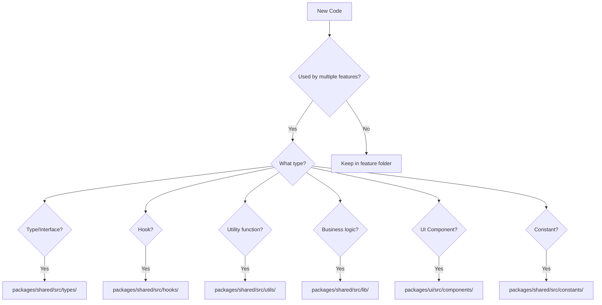

# 📍 SINGLE SOURCE OF TRUTH MAPPING

> **Purpose**: Define canonical locations for all code entities

---

## Core Principle

> Every piece of shared logic, type, or component should exist in **exactly one location**.

---

## Source of Truth Table

### Types

| Type Category | Single Source | Import Pattern |
|---------------|---------------|----------------|
| Employee | `@shared/types/domains/employee` | `import type { Employee } from '@shared/types'` |
| Branch | `@shared/types/domains/branch` | `import type { Branch } from '@shared/types'` |
| Salary | `@shared/types/domains/salary` | `import type { Salary } from '@shared/types'` |
| Deduction | `@shared/types/domains/deduction` | `import type { Deduction } from '@shared/types'` |
| Loan | `@shared/types/domains/deduction` | `import type { Loan } from '@shared/types'` |
| Document | `@shared/types/domains/document` | `import type { EmployeeDocument } from '@shared/types'` |
| Supabase DB | `@shared/types/api/supabase` | `import type { Database } from '@shared/types'` |
| Navigation | `@shared/types/ui/navigation` | `import type { NavItem } from '@shared/types'` |

### Hooks

| Hook | Single Source | Import Pattern |
|------|---------------|----------------|
| `useBranches` | `@shared/hooks/useBranches` | `import { useBranches } from '@shared/hooks'` |
| `useEmployeeForm` | `@shared/hooks/employee` | `import { useEmployeeForm } from '@shared/hooks/employee'` |
| `useEmployeeList` | `@shared/hooks/employee` | `import { useEmployeeList } from '@shared/hooks/employee'` |
| `useDeductions` | `@shared/hooks/employee` | `import { useDeductions } from '@shared/hooks/employee'` |
| `useLoans` | `@shared/hooks/employee` | `import { useLoans } from '@shared/hooks/employee'` |
| `useSalaryData` | `@shared/hooks/salary` | `import { useSalaryData } from '@shared/hooks/salary'` |
| `usePayslipGenerator` | `@shared/hooks/payslip` | `import { usePayslipGenerator } from '@shared/hooks/payslip'` |
| `useToast` | `@shared/hooks/use-toast` | `import { useToast } from '@shared/hooks'` |
| `useMobile` | `@shared/hooks/use-mobile` | `import { useMobile } from '@shared/hooks'` |

### Utilities

| Utility | Single Source | Import Pattern |
|---------|---------------|----------------|
| `formatCurrency` | `@shared/utils/formatters` | `import { formatCurrency } from '@shared/utils'` |
| `formatDate` | `@shared/utils/formatters` | `import { formatDate } from '@shared/utils'` |
| `cn` (classnames) | `@shared/lib/utils` | `import { cn } from '@shared/lib/utils'` |
| `lazyWithRetry` | `@shared/utils/lazyWithRetry` | `import { lazyWithRetry } from '@shared/utils'` |
| `logger` | `@shared/utils/logger` | `import { logger } from '@shared/utils'` |

### Components

| Component | Single Source | Import Pattern |
|-----------|---------------|----------------|
| `Button` | `@shared/ui/button` | `import { Button } from '@shared/ui/button'` |
| `Dialog` | `@shared/ui/dialog` | `import { Dialog } from '@shared/ui/dialog'` |
| `PageLoader` | `@shared/ui/components/shared/loaders/PageLoader` | `import { PageLoader } from '@shared/ui/...'` |
| `ErrorBoundary` | `@shared/ui/components/common/ErrorBoundary` | `import { ErrorBoundary } from '@shared/ui/...'` |
| `Layout` | `@shared/ui/components/shared/Layout` | `import Layout from '@shared/ui/...'` |

### Services

| Service | Single Source | Import Pattern |
|---------|---------------|----------------|
| Supabase Client | `@shared/lib/supabase/client` | `import { supabase } from '@shared/lib/supabase/client'` |
| Query Client | `@shared/lib/query-client` | `import { queryClient } from '@shared/lib/query-client'` |
| Query Keys | `@shared/lib/query-keys` | `import { queryKeys } from '@shared/lib/query-keys'` |
| Salary Calculator | `@shared/lib/salary` | `import { SalaryCalculatorFactory } from '@shared/lib/salary'` |

### Constants

| Constant | Single Source |
|----------|---------------|
| Branch IDs | `@shared/constants/branches` |
| Route paths | `@shared/constants/routes` |
| Design tokens | `@shared/constants/design-tokens` |

---

## Decision Tree: Where Does New Code Go?



---

## Anti-Duplication Rules

### Rule 1: Check Before Creating
```
Before creating any new file:
1. grep_search for existing similar functionality
2. Check @shared/* packages first
3. If exists, import from there
4. If doesn't exist but should be shared, create in packages/
```

### Rule 2: Feature vs Shared
```
Keep in feature folder ONLY if:
- Used exclusively by that feature
- Tightly coupled to feature-specific UI
- Contains feature-specific business rules

Move to shared if:
- Used by 2+ features
- Generic utility
- Reusable across roles (owner/manager/customer)
```

### Rule 3: One Definition Rule
```
Every:
- Type definition → exists in exactly ONE file
- Hook → exists in exactly ONE file
- Utility function → exists in exactly ONE file
- Component → exists in exactly ONE file

No copies. No duplicates. Only imports.
```

---

## Import Alias Reference

| Alias | Maps To |
|-------|---------|
| `@/*` | `src/*` |
| `@app/*` | `src/app/*` |
| `@features/*` | `src/features/*` |
| `@shared/*` | `packages/shared/src/*` |
| `@shared/ui/*` | `packages/ui/src/*` |
| `@shared/lib/*` | `packages/shared/src/lib/*` |
| `@shared/types/*` | `packages/shared/src/types/*` |
| `@shared/hooks/*` | `packages/shared/src/hooks/*` |
| `@shared/utils/*` | `packages/shared/src/utils/*` |
| `@shared/constants/*` | `packages/shared/src/constants/*` |
| `@shared/services/*` | `packages/shared/src/services/*` |

---

*Reference*: [10_VERIFICATION.md](./10_VERIFICATION.md)
